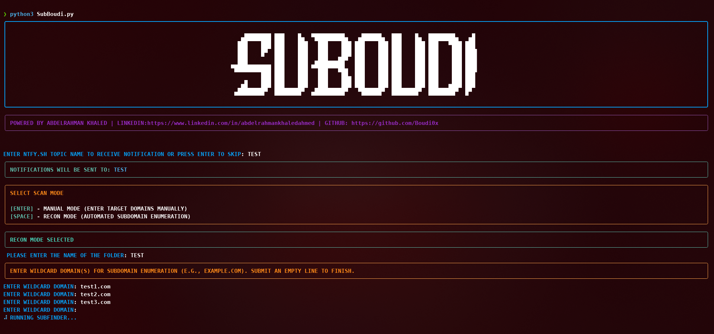

# SuBoudi - Automated Subdomain Enumerator with Notifications

This tool helps automate subdomain enumeration from multiple powerful sources and notifies you when the scan is complete.



## Features
- Aggregates subdomains from multiple sources.
- Sends a notification when the scan is finished.
- Fast and minimal Python-based tool.

## Requirements

- Python 3.x
- `subfinder`, `assetfinder`, `httpx` installed 
- `curl` installed (for notifications)
- Linux/macOS terminal (for running `crt_v2.sh` script)

## How to install Python dependencies

```bash
pip install rich
```
## Setup and Usage

1. Clone the repository:

```bash
git clone https://github.com/your-username/SuBoudi.git
cd SuBoudi
chmod +x crt_v2.sh
chmod +x SuBoudi.py
```

2. Run the main Python script:
```bash
python3 SubBoudi.py
```
## How to Use

1. **Download the [ntfy](https://ntfy.sh/) application on your phone**  
   This tool sends you a mobile notification when the scan finishes.

2. **Set up your ntfy topic:**  
   - Open the ntfy app  
   - Tap the `+` icon in the top right  
   - Choose any topic name you like (e.g. `subscanner123`)  
   - Save it, you'll be asked to enter it when you run the script.

3. Once finished, you’ll get a notification on your phone, and the script will generate:
   - `Subdomains_2xx.txt`  
   - `Subdomains_3xx.txt`  
   - `Subdomains_4xx.txt`
   - 
## Suggestions or Improvements?

If you have any ideas, features, or new sources you'd like to see added, feel free to reach out!  
You’ll find my LinkedIn link displayed when the tool starts running — I’d be happy to collaborate and improve SuBoudi together.


     

